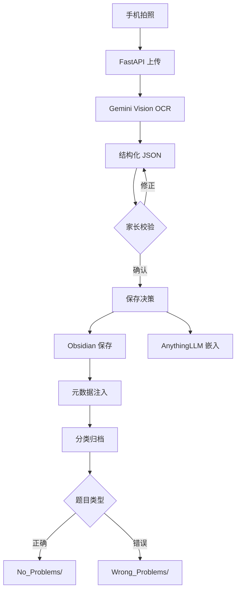

# HL-OS 系统概述

## 项目定位

HL-OS (Home-Learning Operating System) 是一个"前轻后重"的 AI 驱动的家庭智能学习系统，旨在帮助家长更高效地辅导孩子学习，同时为孩子建立终身受益的个人知识资产库。

## 核心理念

### 1. 质量优先
- **强制人工校验**：所有 OCR 识别结果必须经家长确认
- **预览审批**：AI 生成的教学内容需家长批准后才推送
- **数据准确性**：确保进入系统的数据 100% 可靠

### 2. 知识资产化
- **标准化存储**：使用 Obsidian Frontmatter 元数据标准
- **可导出性**：纯文本格式，随时导出，永久保存
- **可迁移性**：不依赖特定平台，数据完全属于用户

### 3. 隐私保护
- **本地优先**：核心数据存储在本地 Obsidian vault
- **最小化云端**：仅 API 调用使用外部服务
- **完全控制**：家长完全掌控数据的存储和使用

## 技术架构

```
┌─────────────────────────────────────────────────────┐
│                    用户层                            │
├──────────────────┬──────────────────────────────────┤
│ 家长控制端       │ 学生学习端                        │
│ (Streamlit Web)  │ (Web/PDF 查看)                   │
└──────────────────┴──────────────┬───────────────────┘
                                   │
┌──────────────────────────────────┴───────────────────┐
│              FastAPI 中控层                          │
├────────────┬─────────────┬─────────────┬────────────┤
│ 模块A      │ 模块B       │ 模块C       │ 模块D      │
│ 感知校验   │ RAG存储     │ 内容生成    │ 评测引擎   │
└────────────┴─────────────┴─────────────┴────────────┘
                                   │
┌──────────────────────────────────┴───────────────────┐
│                   AI 引擎层                          │
├──────────────────┬───────────────────────────────────┤
│ Gemini 3 Pro     │ Claude Sonnet 4.5                │
│ Preview          │ (推理、生成、批改)                │
│ (视觉识别OCR)     │                                  │
└──────────────────┴───────────────────────────────────┘
                                   │
┌──────────────────────────────────┴───────────────────┐
│                   存储层                             │
├─────────────────────┬────────────────────────────────┤
│ AnythingLLM         │ Obsidian Vault                │
│ (海量原始资料检索)   │ (个人精华知识库)               │
│ - 教材全文          │ - 校验后作业                   │
│ - 原始图片          │ - 错题本                       │
│ - 索引链接          │ - 知识卡片                     │
│                     │ - 教学课件                     │
└─────────────────────┴────────────────────────────────┘
```

## 四大核心模块

### 模块 A: 感知与人工校验

**功能流程**：
```
手机拍照 → FastAPI接收 → Gemini Vision OCR → 结构化JSON
    ↓
Streamlit三栏展示 [原图 | AI识别 | 编辑框]
    ↓
家长校验/修正 → 确认后分流:
    ├─ AnythingLLM 嵌入（用于检索）
    └─ Obsidian 保存（.md + Frontmatter）
```

**关键特性**：
- 支持 LaTeX 数学公式识别
- 图片质量预检
- 实时预览和修正
- 元数据自动注入

### 模块 B: RAG 处理与存储分级

**存储策略**：

| 内容类型 | AnythingLLM | Obsidian | 用途 |
|---------|-------------|----------|------|
| 电子教材 | ✅ Hot/可搜索 | ❌ 仅索引 | RAG检索背景知识 |
| 原始图片 | ✅ Cold/存证 | ❌ | 原始凭证备份 |
| 校验作业 | 索引 | ✅ Cold | 长期保存 |
| 错题本 | 索引 | ✅ Cold | 复习练习 |
| 知识卡片 | 索引 | ✅ Cold | 知识沉淀 |
| 教学课件 | ❌ | ✅ Cold | 学习资料 |

**Obsidian 文件标准**：
```markdown
---
Source: "人教版数学九年级上册 P45"
Difficulty: 4
Accuracy: 0.6
Last_Modified: 2024-10-20
Tags: [待复习, 二次函数]
Related_Knowledge_Points: [配方法, 函数图像]
---

# 题目内容...
```

### 模块 C: 教学内容生成

**生成流程**：
```
家长配置参数（知识点、难度、风格、时长）
    ↓
AnythingLLM 检索相关教材内容
    ↓
Claude Sonnet 4.5 生成 Marp PPT Markdown
    ↓
家长预览 → 确认/修改 → 推送学生
    ↓
保存到 Obsidian/Courses/
```

**支持的教学风格**：
- **启发式**：通过问题引导思考
- **费曼式**：用简单语言解释复杂概念
- **详解式**：步骤详细，适合基础薄弱

### 模块 D: 评测引擎

**出题流程**：
```
家长配置（范围、难度分布、题型）
    ↓
Claude 生成原创题目（防搜索设计）
    ↓
学生答题（纸笔） → 拍照上传
    ↓
Gemini OCR识别答案 → Claude自动批改
    ↓
更新 Obsidian 元数据（Accuracy、Attempts）
    ↓
错题自动归档到 Wrong_Problems/
```

**智能批改**：
- 识别解题思路
- 给出详细反馈
- 标注知识盲点
- 追踪学习曲线

## 数据流示意

### 作业处理全流程



## 技术选型理由

### 为什么选择 Gemini 3 Pro Preview？
- ✅ 超长上下文（100万 tokens）
- ✅ 最强视觉识别能力
- ✅ 优秀的结构化输出（JSON）
- ✅ 完美支持 LaTeX 数学公式
- ✅ 多模态理解（文本、图像、音频、视频、PDF）

### 为什么选择 Claude Sonnet 4.5？
- ✅ 世界最强编程和推理模型
- ✅ 超长上下文（100万 tokens with beta header）
- ✅ 顶级的教学内容生成能力
- ✅ 精准的自动批改和反馈
- ✅ 卓越的复杂任务处理能力

### 为什么选择 AnythingLLM？
- ✅ 本地部署，数据安全
- ✅ 支持多种向量数据库
- ✅ 内置 RAG 功能
- ✅ 简单易用

### 为什么选择 Obsidian？
- ✅ 纯文本 Markdown，永不过时
- ✅ 强大的元数据支持
- ✅ 双向链接和知识图谱
- ✅ 完全本地，数据自主

## 系统边界

### 系统做什么
- ✅ 辅助家长整理和管理学习资料
- ✅ 自动化重复性工作（OCR、批改）
- ✅ 提供个性化学习内容生成
- ✅ 建立可持续的知识资产

### 系统不做什么
- ❌ 不替代学校教育
- ❌ 不强制学习路径
- ❌ 不收集敏感数据
- ❌ 不做商业化数据挖掘

## 成功指标

### 效率指标
- OCR 识别准确率 > 90%
- 人工校验时间 < 2分钟/页
- 内容生成时间 < 30秒

### 质量指标
- 家长满意度 > 85%
- 学生成绩提升可量化
- 错题复习覆盖率 100%

### 可持续性指标
- 知识库持续增长
- 数据可随时导出
- 系统稳定运行 > 99%

## 未来扩展方向

### 短期（3-6个月）
- [ ] 移动端适配
- [ ] 多孩子支持
- [ ] 学情分析看板
- [ ] PDF 批量导出

### 中期（6-12个月）
- [ ] 语音讲解功能
- [ ] 错题遗忘曲线算法
- [ ] 家长社区分享
- [ ] 第三方教材库接入

### 长期（1-2年）
- [ ] AI 家教对话
- [ ] 学习路径规划
- [ ] 成长档案生成
- [ ] 升学辅助工具
